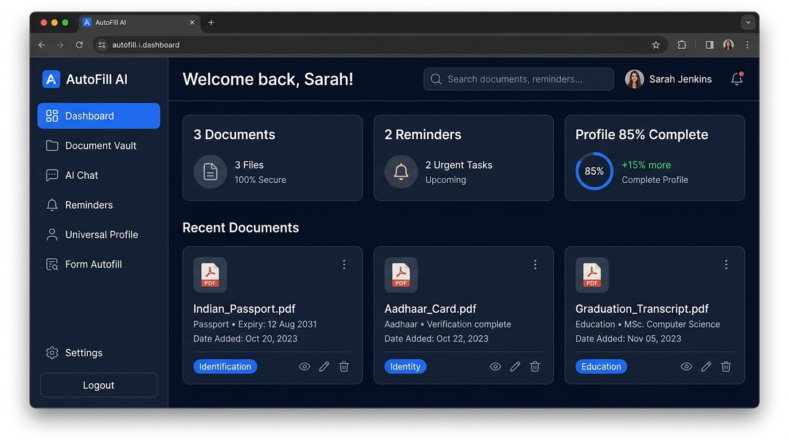
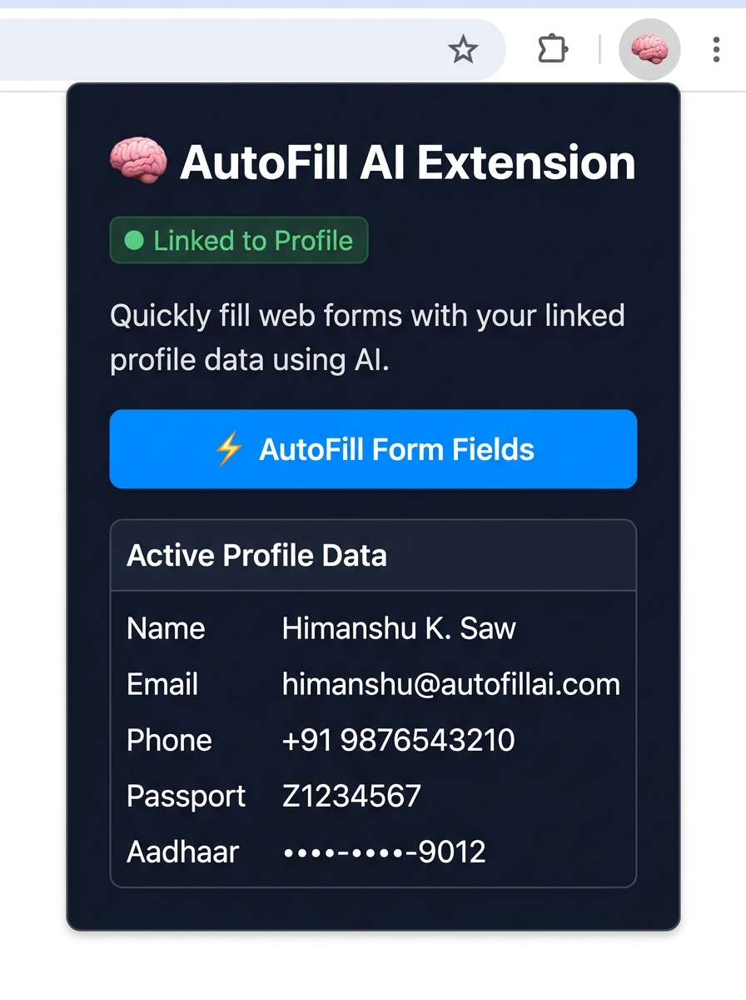
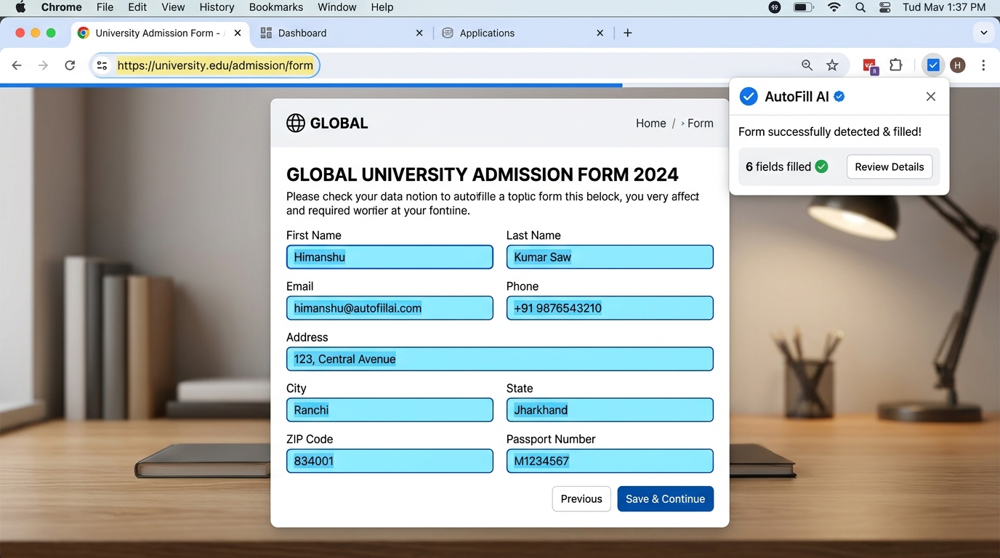

# 🚀 AutoFill AI – Intelligent Browser Form Autofill Using Documents

> Upload your documents once, let AI extract your information, and automatically fill forms on any website through a secure browser extension.


---

## 🌐 Live Demo

> 🚧 **Coming Soon** — Deployment in progress. Stay tuned!

---

## 📖 Table of Contents

- [About](#-about)
- [Problem Statement](#-problem-statement)
- [Solution](#-solution)
- [Screenshots](#-screenshots)
- [Features](#-features)
- [System Architecture](#️-system-architecture)
- [Tech Stack](#-tech-stack)
- [Project Structure](#-project-structure)
- [Installation](#️-installation)
- [Browser Extension Setup](#-browser-extension-setup)
- [OCR Workflow](#-ocr-workflow)
- [AI Workflow](#-ai-workflow)
- [Browser Extension Workflow](#-browser-extension-workflow)
- [API Endpoints](#-api-endpoints)
- [Database Schema](#️-database-schema)
- [Security](#-security)
- [Development Roadmap](#️-development-roadmap)
- [Future Scope](#-future-scope)
- [Contributing](#-contributing)
- [Team](#-team)
- [License](#-license)

---

## 📌 About

**AutoFill AI** is an AI-powered browser autofill system that automatically fills online forms using information extracted from uploaded documents.

Instead of typing the same details repeatedly on different websites, users **upload their documents once**, and the browser extension intelligently detects and fills forms with the extracted information.

The project combines:
- 🤖 Artificial Intelligence & OCR
- 🌐 Browser Automation via Chrome Extension
- ⚛️ React Frontend
- 🟢 Node.js Backend
- 🗄️ MongoDB Database

---

## ❗ Problem Statement

Every day users manually fill the same forms again and again:

| Form Type | Fields Required |
|:---|:---|
| Shipping Address | Name, Phone, Address, ZIP |
| Job Applications | Name, Email, Education, Skills |
| University Admissions | Name, Address, Passport No, Marks |
| Banking / Insurance | PAN, Aadhaar, Address |
| Government Portals | Aadhaar, Passport, DOB |

The same information **already exists** in documents the user has (Passport, Aadhaar, PAN, Resume, Marksheet). This manual copying process:
- ❌ Wastes time
- ❌ Causes typing mistakes
- ❌ Needs to be repeated on every new website

---

## 💡 Solution

**AutoFill AI** extracts structured information from uploaded documents and automatically fills online forms through a browser extension.

```
Upload Documents Once  →  AI Extracts Data  →  Browser Extension Fills Any Form
```

> **"Upload once. Fill everywhere."**

---

## 📸 Screenshots

### Dashboard


### Chrome Extension Popup


### Autofill In Action


---

## ✨ Features

### 📄 Smart Document Upload
- Supports **PDF, JPG, PNG, JPEG, DOCX**
- Drag & drop or click to upload
- Progress indicator with real-time feedback

### 🔍 OCR Text Extraction
- **Tesseract OCR** (local)
- **AWS Textract** (cloud, high accuracy)
- **Google Vision OCR** (multi-language support)

### 🤖 AI Information Extraction
Converts raw OCR output into a clean structured JSON schema:
```json
{
  "name": "Himanshu Kumar Saw",
  "email": "himanshu@autofillai.com",
  "city": "Bengaluru",
  "state": "Karnataka",
  "zipcode": "560102",
  "passport": "Z1234567",
  "aadhaar": "1234-5678-9012"
}
```

### 👤 Universal Profile
Creates a reusable digital profile with:
- Personal Details (Name, DOB, Gender)
- Contact Info (Email, Phone)
- Address (Street, City, State, Country, ZIP)
- Government IDs (Passport, Aadhaar, PAN)
- Education & Career Info

### 🌐 Browser Extension
- Compatible with **Chrome, Edge, Brave, Opera**
- Built with **Manifest V3** (modern, secure)
- Works on **any website** with form fields
- No data sent to third parties

### 🧠 AI Form Detection
Intelligently maps label variations to profile keys:

| Website Label | Maps To |
|:---|:---|
| `Email`, `Email Address`, `Your Email`, `Official Email` | `email` |
| `Postal Code`, `Zip Code`, `PIN`, `Pincode` | `zipcode` |
| `Mobile`, `Contact No`, `Phone No` | `phone` |
| `Passport No`, `Travel Document ID` | `passport` |

### ⚡ One Click Autofill
Click **Fill Form** from the extension toolbar — everything completes **instantly**.

---

## 🏗️ System Architecture

```
                        User
                          │
                          ▼
              ┌─── Upload Documents ───┐
              │   PDF │ JPG │ PNG │ DOCX │
              └────────────────────────┘
                          │
                          ▼
                   OCR Extraction
              (Tesseract / Textract / Vision)
                          │
                          ▼
                 AI Information Parser
                  (Gemini / OpenAI LLM)
                          │
                          ▼
             Structured Profile JSON
                          │
                          ▼
               MongoDB Database Storage
                          │
                          ▼
              Chrome Extension (Manifest V3)
                          │
                ┌─────────┴─────────┐
                ▼                   ▼
         Detect Form Fields   Fetch Profile Data
                │                   │
                └─────────┬─────────┘
                          ▼
                AI Label Matching Engine
                          │
                          ▼
                 Fill Form Inputs ✓
```

---

## 🛠 Tech Stack

| Layer | Technology |
|:---|:---|
| **Frontend** | React.js, Vite, Tailwind CSS, Framer Motion |
| **Backend** | Node.js, Express.js |
| **Database** | MongoDB, Mongoose |
| **AI / LLM** | OpenAI GPT API, Google Gemini API |
| **OCR** | Tesseract.js, AWS Textract |
| **Browser Extension** | Chrome Manifest V3, Vanilla JS |
| **Authentication** | JWT, Bcrypt |
| **File Storage** | AWS S3, Cloudinary |
| **Deployment** | Vercel (Frontend), Railway (Backend) |

---

## 📂 Project Structure

```
AutoFill-AI/
│
├── frontend/                  # React Web Application
│   ├── src/
│   │   ├── pages/             # All page components
│   │   ├── components/        # Reusable UI components
│   │   │   └── layout/        # Sidebar, Navbar, ProtectedRoute
│   │   ├── context/           # AuthContext (global state)
│   │   ├── services/          # API client & service calls
│   │   └── main.jsx           # App entry point
│   ├── index.html
│   └── vite.config.js
│
├── backend/                   # Node.js + Express Server
│   ├── controllers/           # Route handler logic
│   ├── routes/                # API route definitions
│   ├── models/                # MongoDB Mongoose schemas
│   ├── middleware/            # Auth, rate limiting, error handling
│   ├── services/              # OCR & AI service integrations
│   ├── jobs/                  # Cron jobs (reminder engine)
│   └── server.js              # App entry point
│
├── extension/                 # Chrome Browser Extension
│   ├── manifest.json          # Manifest V3 config
│   ├── popup.html             # Extension popup UI
│   ├── popup.js               # Popup interaction handler
│   └── content.js             # DOM scanning & field autofill engine
│
├── docker-compose.yml         # Full stack Docker setup
├── README.md
└── package.json
```

---

## ⚙️ Installation

### Prerequisites
- Node.js v18+
- MongoDB (local or Atlas)
- Google Gemini API Key

### 1. Clone the Repository
```bash
git clone https://github.com/himanshukumarsaw/Memora-AI.git
cd Memora-AI
```

### 2. Run the Backend
```bash
cd backend
npm install
npm run dev
```
> Backend starts at `http://localhost:5000`

### 3. Run the Frontend
```bash
cd frontend
npm install
npm run dev
```
> Frontend starts at `http://localhost:3000`

### 4. Run with Docker (Full Stack)
```bash
docker-compose up --build
```

---

## 🌐 Browser Extension Setup

1. Open **Google Chrome** and go to `chrome://extensions/`
2. Enable **Developer Mode** (toggle in the top-right corner)
3. Click **Load Unpacked** (button in the top-left corner)
4. Select the `extension/` folder from this project directory
5. The **AutoFill AI** extension will appear in your toolbar
6. Open any website with a form → Click the extension → Click **AutoFill Form Fields** ⚡

---

## 📄 OCR Workflow

```
Upload Document
      │
      ▼
File Validation (type, size)
      │
      ▼
OCR Processing
(Tesseract / AWS Textract / Google Vision)
      │
      ▼
Raw Text Extracted
      │
      ▼
AI Parser (Gemini / OpenAI)
      │
      ▼
Structured JSON Profile
      │
      ▼
Saved to MongoDB
```

---

## 🤖 AI Workflow

**Input (Raw OCR Text):**
```
REPUBLIC OF INDIA - PASSPORT
Name: Himanshu Kumar Saw
Passport No: Z1234567
Date of Birth: 15/08/2002
Expiry: 20/09/2032
Address: 123 Tech Lane, Bengaluru, Karnataka - 560102
```

**Output (Structured JSON):**
```json
{
  "firstName": "Himanshu",
  "lastName": "Kumar Saw",
  "passport": "Z1234567",
  "dob": "15/08/2002",
  "passportExpiry": "20/09/2032",
  "address": "123 Tech Lane",
  "city": "Bengaluru",
  "state": "Karnataka",
  "zipcode": "560102"
}
```

---

## 🌍 Browser Extension Workflow

```
User Opens Website
        │
        ▼
Extension Icon Clicked
        │
        ▼
content.js Scans All Input Fields
        │
        ▼
Label / Name / Placeholder Parsed
        │
        ▼
AI Matching Engine Maps Labels → Profile Keys
        │
        ▼
Form Fields Filled Automatically
        │
        ▼
✅ Done — No Manual Typing Required
```

---

## 📦 API Endpoints

### Authentication
| Method | Endpoint | Description |
|:---|:---|:---|
| `POST` | `/api/auth/register` | Create new account |
| `POST` | `/api/auth/login` | Login & receive JWT |
| `POST` | `/api/auth/logout` | Logout session |

### Documents
| Method | Endpoint | Description |
|:---|:---|:---|
| `POST` | `/api/documents/upload` | Upload file to AI pipeline |
| `GET` | `/api/documents` | List all vault documents |
| `DELETE` | `/api/documents/:id` | Delete a document |

### Profile & Autofill
| Method | Endpoint | Description |
|:---|:---|:---|
| `GET` | `/api/profile` | Get Universal Profile |
| `PUT` | `/api/profile` | Update Profile |
| `POST` | `/api/autofill/analyze` | Analyze form & return autofill fields |

---

## 🗄️ Database Schema

### User
```javascript
{ name, email, password, createdAt }
```

### Document
```javascript
{ userId, title, category, fileUrl, extractedText, sizeBytes, isFavorite, createdAt }
```

### Profile
```javascript
{
  userId, firstName, lastName, email, phone,
  address, city, state, country, zipcode,
  passport, aadhaar, pan, education, skills
}
```

---

## 🔒 Security

- ✅ JWT Token Authentication
- ✅ Password Hashing with Bcrypt
- ✅ Rate Limiting on all API routes
- ✅ Helmet.js HTTP security headers
- ✅ User Consent Required Before Autofill
- ✅ No Automatic Form Submission
- ✅ Encrypted File Storage
- ✅ Data stays local (no third-party sharing)

---

## 🗺️ Development Roadmap

- [x] **Phase 1** — Authentication & User Registration
- [x] **Phase 2** — Document Upload & Secure Storage
- [x] **Phase 3** — OCR Text Extraction Pipeline
- [x] **Phase 4** — AI Information Parser (JSON Extraction)
- [x] **Phase 5** — Universal Profile Builder
- [x] **Phase 6** — Chrome Extension with Form Detection
- [x] **Phase 7** — One-Click Autofill Engine
- [ ] **Phase 8** — Cloud Deployment (Vercel + Railway)
- [ ] **Phase 9** — Firefox & Edge Extension Support
- [ ] **Phase 10** — Mobile App Integration

---

## 🚀 Future Scope

- 🦊 Firefox & Safari Extension
- 📱 Mobile Application
- 🏢 Team & Enterprise Multi-Profile Support
- 🌍 Multi-language OCR (Hindi, Tamil, Gujarati)
- 🔊 Voice Autofill
- 📊 Analytics Dashboard
- 🤝 API for Third-Party Integrations

---

## 🤝 Contributing

Contributions are welcome!

```bash
# Fork the repository
git checkout -b feature/your-feature-name
git commit -m "Add: your feature description"
git push origin feature/your-feature-name
# Open a Pull Request
```

---

## 👥 Team

| Name | Role |
|:---|:---|
| **Himanshu Kumar Saw** | Full Stack Developer & Project Lead |
| *(Team Member 2)* | *(Role)* |
| *(Team Member 3)* | *(Role)* |

---

## 📄 License

This project is licensed under the **MIT License** — feel free to use, modify, and share!

---

## ⭐ Support

If you find this project useful, please:

- ⭐ **Star** this repository
- 🍴 **Fork** it
- 🛠️ **Contribute** to it
- 📢 **Share** it with others

---

> **"Upload once. Fill everywhere."** — AutoFill AI
